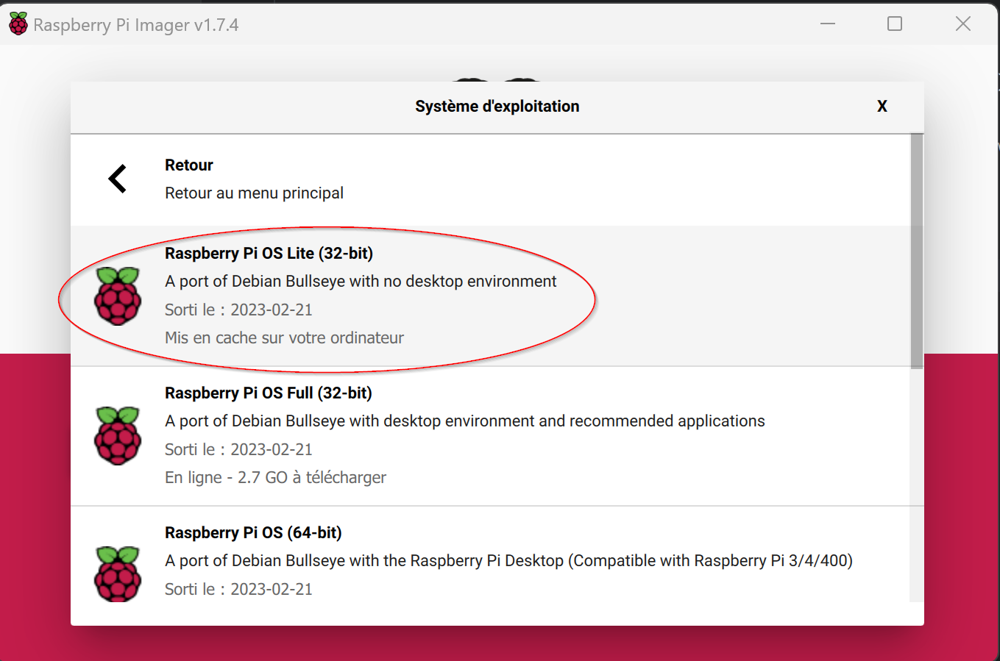

# PI-timelapse

This project aims to take photos automatically every x seconds with the raspberry camera and the PiCamera2 library. 
Then, it sends  the photos to a backend FTP which compute a video with ffmpeg and output a mp4 video. 

Required stuff :
- 1 raspberry pi zero (but it should work with any raspberry pi supporting camera)
- 1 pi camera v3 (but should work with previous models)
- 1 ribbon cable for pi zero (only with pi zero)
- 3D-printed camera support (TODO : link to thingiverse)
- 3D-printed raspberry pi zero box (TODO: link to thingiverse)
- FTP server (to receive snapshots)
- linux or docker based server supporting ffmpeg (to compute video)

# Install from scratch on raspberry pi zero

1. Use RPI Imager to install Raspbian OS lite (version bullseye)
   
2. Connect with SSH on the RPI
3. Check for update & upgrade using these commands :
   ```
   sudo apt update
   sudo apt upgrade
   ```
4. Install files in `/home/pi/pi-timelapse/`
5. Edit FTP config in timelapse-service.service
6. Then copy it in systemd :
   ```
   sudo cp /home/pi/pi-timelapse/timelapse-service.service /lib/systemd/system/timelapse-service.service
   sudo chmod 644 /lib/systemd/system/timelapse-service.service
   chmod +x /home/pi/pi-timelapse/timelapse_pi_camera.py
   sudo systemctl daemon-reload
   sudo systemctl enable timelapse-service.service
   sudo systemctl start timelapse-service.service
   ```

> NOTE:
>   Be sure that the FTP hostname is resolvable by the PI
>   In my case, I had to add my Synology NAS hostname manually in `/etc/hosts`

# Sources / inspiration
[magpi.cc/timelapsepy](https://magpi.cc/timelapsepy)

